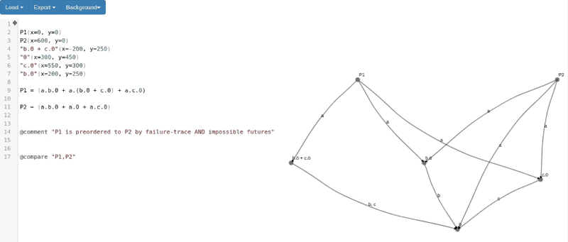

# Linear-Time–Branching-Time Spectroscope

The “Linear-time–Branching-time Spectroscope” is a web app to find all preorders, equivalences and inequivalences from the (strong) linear-time–branching-time spectrum for small processes as described in [Bisping, Jansen, Nestmann, LMCS 2022](https://doi.org/10.46298/lmcs-18(3:19)2022).

It runs online on https://equiv.io/ .



Just input CCS-style processes, give the two processes you want to compare with `@compare "P1,P2"` and click on the gutter next to the compare-statement!

To explore possible minimizations of the system, write `@minimize` and click on the gutter!

It's also possible to enter processes with internal behavior, either by `tau.P` actions or due to communication, `(a.0 | a!0) \ {a}`. To compare with respect to the weak spectrum, use `@compareSilent "P1,P2"`.

## How to build

The project can be built using `sbt` by.

```
sbt webStage
```

This will download all dependencies and output a website under `web/target/web/stage/index.html` that can be run locally in any modern browser.

In order to test that the algorithm determines the expected (in-)equivaences for the example processes from https://citeseerx.ist.psu.edu/viewdoc/summary?doi=10.1.1.36.8596, run:

```
sbt "shared/test"
```

To perform benchmarks, run:

```
sbt "shared/run benchmark"
```

## Docker image

To build a docker image that bundles the Scala dependencies and the fiddle (and export it to tgz), run:

```
docker build . -t equivalence-fiddle
docker save equivalence-fiddle | gzip > doc/artifact/equivalence-fiddle-docker.tar.gz
```

By default, the docker image starts up a small webserver serving the fiddle on 8080, which can be made live on <http://127.0.0.1:8080> like this:

```
docker run -p 127.0.0.1:8080:8080 --name equivalence-fiddle -d equivalence-fiddle
```

To reproduce benchmarks from the container, you then can (for instance) run:

```
docker exec -it equivalence-fiddle sbt "shared/run benchmark"
```

## Theoretical background

The algorithm uses a generalization of the bisimulation game to find all relevant distinguishing Hennessy–Milner logic formulas for two compared finite-state processes. Using these, we can give a precise characterization of how much distinguishing power is needed to tell two processes apart—and thus also determine the best fit of equivalences to equate them.

## Developed by

The LTBT Spectroscope is developed at [MTV TU Berlin](https://www.mtv.tu-berlin.de) by [Benjamin Bisping](https://bbisping.de) (benjamin.bisping@tu-berlin.de).

The code is subject to the MIT License to be found in `LICENSE`. The full source can be obtained from <https://concurrency-theory.org/ltbt-spectroscope/code/> and via [](https://doi.org/10.5281/zenodo.6726494).
